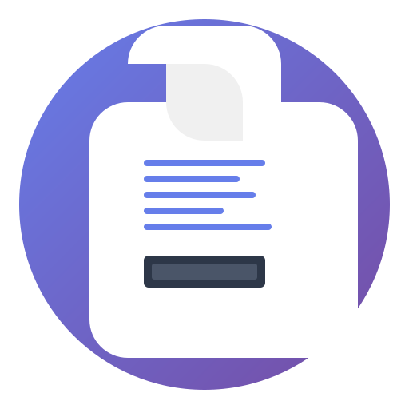

# Markdown Reader Pro 📚✨

> **A professional, cross-platform markdown reader built with Electron featuring modern UI/UX, syntax highlighting, and advanced features**

[](https://electronjs.org/)
[](https://nodejs.org/)
[](https://opensource.org/licenses/MIT)
[](https://github.com/Dragon745/Markdown-Reader)

<div align="center">
  
  
  **Professional Markdown Reading Experience Across All Platforms**
</div>

---

## 🚀 What is Markdown Reader Pro?

Markdown Reader Pro is a sophisticated desktop application that transforms how developers, writers, and technical professionals read and interact with markdown documents. Built with modern web technologies and packaged as a native desktop app, it delivers a premium reading experience with enterprise-grade features.

### Why It Exists

- **Professional Needs**: Traditional text editors lack the polished reading experience needed for technical documentation
- **Cross-Platform Consistency**: Provides the same excellent experience across Windows, macOS, and Linux
- **Developer Experience**: Built by developers, for developers - with attention to detail that matters
- **Modern UI/UX**: Leverages contemporary design principles for an intuitive, accessible interface

---

## ✨ Key Features & Capabilities

### 🎨 **Visual Excellence**

- **Syntax Highlighting**: Powered by highlight.js with GitHub Dark theme
- **Multiple Themes**: Light, Dark, and Auto (system preference) modes
- **Responsive Design**: Adapts seamlessly to any screen size or resolution
- **Typography Control**: Adjustable font sizes and line heights for optimal readability

### 🖱️ **User Experience**

- **Drag & Drop**: Intuitive file loading with visual feedback
- **Keyboard Shortcuts**: Power-user shortcuts for efficient navigation
- **File Management**: Recent files, file info display, and path copying
- **Accessibility**: ARIA labels, keyboard navigation, and screen reader support

### 🔧 **Professional Tools**

- **Export Options**: Convert to HTML with custom styling
- **Print Support**: Optimized printing with proper page breaks
- **Settings Persistence**: User preferences saved across sessions
- **Error Handling**: Graceful error states with helpful recovery options

### 🚀 **Performance & Reliability**

- **Fast Rendering**: Optimized markdown parsing with marked.js
- **Memory Efficient**: Lightweight Electron implementation
- **Cross-Platform**: Native builds for Windows, macOS, and Linux
- **Auto-Updates**: Built-in update mechanism for seamless maintenance

---

## 🖼️ Demo & Screenshots

### Main Interface


### Dark Theme with Syntax Highlighting


### Settings Panel


---

## 🚀 Quick Start Guide

### Prerequisites

- **Node.js** 18+ and **npm** 9+
- **Git** for cloning the repository

### Installation

```bash
# Clone the repository
git clone https://github.com/Dragon745/Markdown-Reader.git
cd Markdown-Reader

# Install dependencies
npm install

# Start development mode
npm start

# Build for production
npm run build
```

### Platform-Specific Builds

```bash
# Windows
npm run build:win:prod

# macOS
npm run build:mac:prod

# Linux
npm run build:linux:prod
```

### Running the Application

1. **Launch**: Double-click the executable or run from command line
2. **Open File**: Use `Ctrl+O` (or `Cmd+O` on macOS) or drag & drop
3. **Customize**: Access settings via the gear icon in the header
4. **Export**: Use the export button to save as HTML

---

## 💡 Example Use Cases

### 🏢 **Enterprise Development Teams**

- **Technical Documentation**: Read API docs, architecture guides, and design specs
- **Code Reviews**: View markdown-based PR descriptions and review comments
- **Knowledge Sharing**: Access team wikis and shared documentation

### 👨‍💻 **Individual Developers**

- **Project READMEs**: Professional reading experience for open-source projects
- **Personal Notes**: Clean interface for technical journals and learning notes
- **Portfolio**: Present markdown-based portfolios with polished formatting

### 📚 **Content Creators**

- **Technical Writing**: Distraction-free environment for writing technical content
- **Documentation**: Create and preview documentation before publishing
- **Presentations**: Convert markdown to HTML for web-based presentations

### 🎓 **Students & Educators**

- **Course Materials**: Read lecture notes and course documentation
- **Research Papers**: Clean interface for academic markdown documents
- **Collaboration**: Share and review group project documentation

---

## 🛠️ Tech Stack

### **Frontend Technologies**

- **HTML5**: Semantic markup with accessibility features
- **CSS3**: Modern styling with CSS custom properties and flexbox
- **JavaScript (ES6+)**: Modern JavaScript with async/await and modules

### **Desktop Framework**

- **Electron 28.0.0**: Cross-platform desktop application framework
- **Node.js Integration**: File system access and native OS integration
- **IPC Communication**: Secure main-renderer process communication

### **Markdown Processing**

- **marked.js 9.1.6**: Fast markdown parser with GFM support
- **highlight.js 11.9.0**: Syntax highlighting for 190+ programming languages
- **Custom Renderer**: Optimized HTML output with semantic markup

### **Build & Distribution**

- **electron-builder**: Professional packaging and distribution
- **Multi-platform**: Windows (NSIS, Portable), macOS (DMG), Linux (AppImage, DEB)
- **Auto-updates**: GitHub releases integration

---

## 🤝 Contributing

We welcome contributions from the community! Here's how you can help:

### **Getting Started**

1. Fork the repository
2. Create a feature branch: `git checkout -b feature/amazing-feature`
3. Make your changes and test thoroughly
4. Commit with clear messages: `git commit -m 'Add amazing feature'`
5. Push to your branch: `git push origin feature/amazing-feature`
6. Open a Pull Request

### **Development Guidelines**

- Follow existing code style and patterns
- Add tests for new functionality
- Update documentation for API changes
- Ensure cross-platform compatibility
- Test on multiple operating systems

### **Areas for Contribution**

- **UI/UX Improvements**: Better accessibility, responsive design
- **Performance**: Optimize rendering, reduce memory usage
- **Features**: Additional export formats, plugin system
- **Documentation**: Better examples, tutorials, API docs
- **Testing**: Unit tests, integration tests, E2E tests

---

## 📄 License

This project is licensed under the **MIT License** - see the [LICENSE](LICENSE) file for details.

The MIT License is one of the most permissive open-source licenses, allowing:

- ✅ Commercial use
- ✅ Modification and distribution
- ✅ Private use
- ✅ Patent use
- ✅ Only requires license and copyright notice preservation

---

## 🙏 Acknowledgments

- **Electron Team**: For the amazing cross-platform framework
- **marked.js Contributors**: For the excellent markdown parser
- **highlight.js Team**: For comprehensive syntax highlighting
- **Open Source Community**: For inspiration and collaboration

---

## 📞 Support & Community

- **Issues**: [GitHub Issues](https://github.com/Dragon745/Markdown-Reader/issues)
- **Discussions**: [GitHub Discussions](https://github.com/Dragon745/Markdown-Reader/discussions)
- **Wiki**: [Project Wiki](https://github.com/Dragon745/Markdown-Reader/wiki)

## 🔗 Connect & Support

### **Personal Links**

- **Portfolio**: [syedqutubuddin.in](https://syedqutubuddin.in)
- **AI Bot**: [psychebot.pro](https://psychebot.pro)
- **Web Services**: [website14.com](https://website14.com)

### **Support the Project**

- **Buy Me a Coffee**: [buymeacoffee.com/contact9rg](https://buymeacoffee.com/contact9rg)

---

<div align="center">
  <p><strong>Made with ❤️ by the Markdown Reader Pro Team</strong></p>
  <p>If this project helps you, please consider giving it a ⭐️</p>
</div>
