# System Map - Markdown Reader Pro

## 🗺️ Visual Atlas of Project Architecture & Components

> **A comprehensive visual guide to the Markdown Reader Pro system architecture, data flows, and component interactions**

---

## 📋 Visual Index

1. [High-Level System Architecture](#high-level-system-architecture)
2. [Process Communication Flow](#process-communication-flow)
3. [File Loading Sequence](#file-loading-sequence)
4. [User Interface State Machine](#user-interface-state-machine)
5. [Data Flow Architecture](#data-flow-architecture)
6. [Component Interaction Map](#component-interaction-map)
7. [Error Handling Flow](#error-handling-flow)
8. [Settings Management Flow](#settings-management-flow)
9. [Theme System Architecture](#theme-system-architecture)
10. [Build & Deployment Pipeline](#build--deployment-pipeline)

---

## 🏗️ High-Level System Architecture

### System Overview Diagram

**Architecture Components:**

- **Main Process**: Handles system operations, file I/O, and IPC routing
- **Renderer Process**: Manages UI rendering, user interactions, and state
- **External Dependencies**: Third-party libraries for markdown processing
- **IPC Bridge**: Secure communication between processes

---

## 🔄 Process Communication Flow

### IPC Communication Architecture

**Communication Patterns:**

- **Request-Response**: For file operations and metadata
- **Event-Driven**: For file selection and system events
- **Error Handling**: Consistent error response structure

---

## 📁 File Loading Sequence

### Complete File Processing Pipeline

**Processing Stages:**

1. **Input Validation**: Check file type and permissions
2. **File Reading**: Asynchronous file system operations
3. **Content Processing**: Markdown parsing and syntax highlighting
4. **UI Update**: DOM manipulation and state management
5. **Error Handling**: Graceful degradation and user feedback

---

## 🎮 User Interface State Machine

### Application State Transitions

**State Descriptions:**

- **Initial**: Application startup and initialization
- **DropZone**: File selection interface
- **Loading**: File processing and rendering
- **MarkdownView**: Document display and interaction
- **Settings**: Configuration and preferences
- **Help**: Documentation and shortcuts
- **Error**: Error display and recovery

---

## 🔀 Data Flow Architecture

### Data Movement Through System

**Data Flow Characteristics:**

- **Unidirectional**: Data flows from input to output
- **State-Driven**: UI updates based on state changes
- **Persistent**: User preferences saved across sessions
- **Reactive**: Automatic updates on data changes

---

## 🔧 Component Interaction Map

### Detailed Component Relationships

**Component Responsibilities:**

- **Main Process**: System operations and IPC routing
- **Preload Bridge**: Secure API exposure
- **Renderer**: UI logic and user interactions
- **UI Layer**: Visual presentation and styling
- **External Libraries**: Specialized functionality

---

## 🚨 Error Handling Flow

### Error Management Architecture

**Error Handling Strategy:**

- **Categorization**: Different handlers for different error types
- **User Experience**: Friendly error messages with recovery options
- **Graceful Degradation**: Fallback mechanisms for non-critical errors
- **Logging**: Comprehensive error logging for debugging

---

## ⚙️ Settings Management Flow

### Configuration System Architecture

**Settings Features:**

- **Persistence**: Settings saved across application sessions
- **Validation**: Input validation and sanitization
- **Real-time Updates**: Immediate application of setting changes
- **Fallbacks**: Default values for missing or invalid settings

---

## 🎨 Theme System Architecture

### Dynamic Theme Management

**Theme System Features:**

- **Dynamic Switching**: Real-time theme changes
- **System Integration**: Automatic detection of OS preferences
- **CSS Variables**: Centralized theme management
- **Accessibility**: Support for reduced motion preferences

---

## 🚀 Build & Deployment Pipeline

### Production Build Process

**Build Features:**

- **Multi-platform**: Simultaneous builds for all platforms
- **Optimization**: Code minification and asset optimization
- **Packaging**: Platform-specific package formats
- **Distribution**: Automated release management

---

## 📊 Performance Metrics & Benchmarks

### System Performance Characteristics

**Performance Targets:**

- **Startup**: Under 2 seconds on modern hardware
- **Rendering**: 1MB markdown files in under 100ms
- **Memory**: Less than 100MB for typical documents
- **Responsiveness**: UI updates in under 16ms (60fps)

---

## 🔍 Debugging & Development Tools

### Development Environment Setup

**Development Features:**

- **Hot Reload**: Instant code changes without restart
- **Source Maps**: Debug original source code
- **Performance Profiling**: Identify bottlenecks
- **Error Tracking**: Comprehensive error logging

---

## 🌐 Cross-Platform Compatibility Matrix

### Platform Support & Features

```mermaid
graph TB
    subgraph "Supported Platforms"
        WINDOWS[Windows 10+]
        MACOS[macOS 10.14+]
        LINUX[Ubuntu 18.04+]
    end

    subgraph "Platform Features"
        WIN_FEATURES[Windows Features<br/>• NSIS Installer<br/>• Portable Executable<br/>• Start Menu Integration]
        MAC_FEATURES[macOS Features<br/>• DMG Package<br/>• App Store Ready<br/>• Native Menu Bar]
        LINUX_FEATURES[Linux Features<br/>• AppImage Package<br/>• DEB Package<br/>• Desktop Integration]
    end

    subgraph "Common Features"
        COMMON[Cross-Platform Features<br/>• Electron Framework<br/>• Node.js Integration<br/>• Web Technologies]
    end

    WINDOWS --> WIN_FEATURES
    MACOS --> MAC_FEATURES
    LINUX --> LINUX_FEATURES

    WIN_FEATURES --> COMMON
    MAC_FEATURES --> COMMON
    LINUX_FEATURES --> COMMON
```

**Platform Support:**

- **Windows**: Full installer and portable versions
- **macOS**: DMG packages with App Store compatibility
- **Linux**: Multiple package formats for different distributions

---

_This system map provides a comprehensive visual understanding of the Markdown Reader Pro architecture. Each diagram illustrates specific aspects of the system, from high-level architecture to detailed component interactions._
