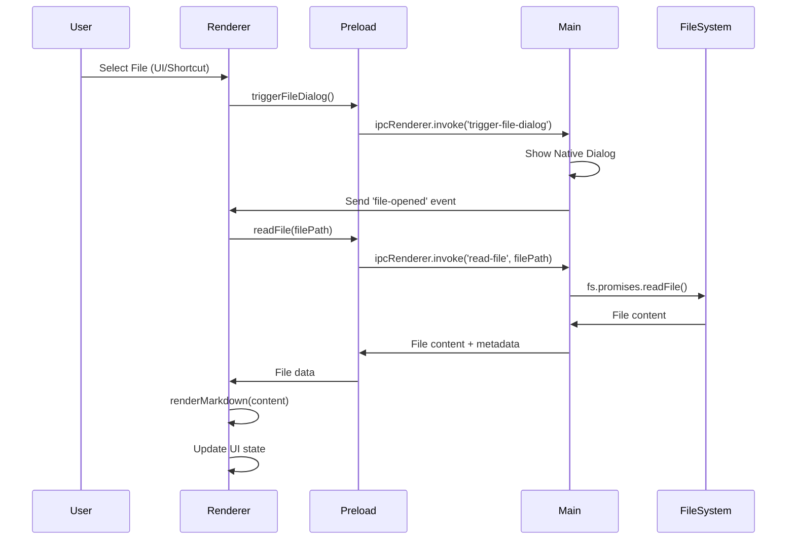

# Technical Design Document

## Markdown Reader Pro - System Architecture & Implementation

> **Comprehensive technical breakdown of the Markdown Reader Pro application architecture, components, and implementation details**

---

## 📋 Table of Contents

1. [System Architecture Overview](#system-architecture-overview)
2. [Core Components & Modules](#core-components--modules)
3. [Data Flow & State Management](#data-flow--state-management)
4. [API Design & IPC Communication](#api-design--ipc-communication)
5. [Security & Sandboxing](#security--sandboxing)
6. [Performance Considerations](#performance-considerations)
7. [Error Handling & Edge Cases](#error-handling--edge-cases)
8. [Cross-Platform Compatibility](#cross-platform-compatibility)
9. [Testing Strategy](#testing-strategy)
10. [Deployment & Distribution](#deployment--distribution)

---

## 🏗️ System Architecture Overview

### High-Level Architecture

Markdown Reader Pro follows a **multi-process Electron architecture** with clear separation of concerns:

```
┌─────────────────────────────────────────────────────────────┐
│                    Main Process (Node.js)                  │
│  ┌─────────────────┐  ┌─────────────────┐  ┌─────────────┐ │
│  │   App Lifecycle │  │   File System   │  │   IPC Hub   │ │
│  │   Management    │  │   Operations    │  │             │ │
│  └─────────────────┘  └─────────────────┘  └─────────────┘ │
└─────────────────────────────────────────────────────────────┘
                              │
                              │ IPC Communication
                              ▼
┌─────────────────────────────────────────────────────────────┐
│                 Renderer Process (Browser)                 │
│  ┌─────────────────┐  ┌─────────────────┐  ┌─────────────┐ │
│  │   UI Layer      │  │   Markdown      │  │   Settings  │ │
│  │   (HTML/CSS)    │  │   Renderer      │  │   Manager   │ │
│  └─────────────────┘  └─────────────────┘  └─────────────┘ │
└─────────────────────────────────────────────────────────────┘
```

### Process Separation Benefits

- **Security**: Renderer process runs in sandboxed environment
- **Performance**: Main process handles heavy I/O operations
- **Reliability**: Renderer crashes don't affect main process
- **Maintainability**: Clear separation of concerns

---

## 🔧 Core Components & Modules

### 1. Main Process (`main.js`)

#### **App Lifecycle Management**

```javascript
// App initialization and window management
app.whenReady().then(() => {
  createWindow();
  createMenu();
  setupIPC();
});
```

**Key Responsibilities:**

- Application lifecycle management
- Window creation and management
- Native menu system
- IPC handler registration
- File system operations

#### **Window Management**

```javascript
function createWindow() {
  mainWindow = new BrowserWindow({
    width: 1200,
    height: 800,
    webPreferences: {
      nodeIntegration: false,
      contextIsolation: true,
      preload: path.join(__dirname, "preload.js"),
      enableRemoteModule: false,
    },
  });
}
```

**Security Features:**

- `nodeIntegration: false` - Prevents direct Node.js access
- `contextIsolation: true` - Isolates main and renderer contexts
- `preload` script - Controlled API exposure

#### **Menu System**

```javascript
function createMenu() {
  const template = [
    {
      label: "File",
      submenu: [
        {
          label: "Open File",
          accelerator: "CmdOrCtrl+O",
          click: async () => {
            /* ... */
          },
        },
      ],
    },
  ];
}
```

**Features:**

- Platform-specific menu adaptations
- Keyboard shortcut integration
- Native OS menu integration

### 2. Preload Script (`preload.js`)

#### **API Bridge Design**

```javascript
contextBridge.exposeInMainWorld("electronAPI", {
  readFile: (filePath) => ipcRenderer.invoke("read-file", filePath),
  getFileInfo: (filePath) => ipcRenderer.invoke("get-file-info", filePath),
  onFileOpened: (callback) => ipcRenderer.on("file-opened", callback),
  triggerFileDialog: () => ipcRenderer.invoke("trigger-file-dialog"),
});
```

**Security Model:**

- **Context Isolation**: Prevents direct access to Node.js APIs
- **Controlled Exposure**: Only specific functions are exposed
- **Input Validation**: All parameters validated before processing

#### **Event Handling**

```javascript
onFileOpened: (callback) => {
  return ipcRenderer.on("file-opened", callback);
};
```

**Pattern:**

- Event-driven architecture
- Callback-based communication
- Automatic cleanup on window close

### 3. Renderer Process (`renderer.js`)

#### **Application State Management**

```javascript
let currentFile = null;
let currentTheme = "auto";
let currentFontSize = "medium";
let currentLineHeight = "normal";
```

**State Variables:**

- `currentFile`: Currently loaded file metadata
- `currentTheme`: Active theme (light/dark/auto)
- `currentFontSize`: Typography settings
- `currentLineHeight`: Readability preferences

#### **Event-Driven Architecture**

```javascript
function setupEventListeners() {
  openFileBtn.addEventListener("click", async () => {
    try {
      const result = await window.electronAPI.triggerFileDialog();
    } catch (error) {
      console.error("Error triggering file dialog:", error);
    }
  });
}
```

**Event Categories:**

- **User Interactions**: Button clicks, keyboard shortcuts
- **File Operations**: Drag & drop, file selection
- **Settings Changes**: Theme, typography, preferences
- **System Events**: Window resize, focus changes

#### **Markdown Rendering Pipeline**

```javascript
function renderMarkdown(content) {
  // Configure marked options
  marked.setOptions({
    highlight: function (code, lang) {
      if (lang && hljs.getLanguage(lang)) {
        try {
          return hljs.highlight(code, { language: lang }).value;
        } catch (err) {
          console.warn("Highlight.js error:", err);
        }
      }
      return hljs.highlightAuto(code).value;
    },
    breaks: true,
    gfm: true,
  });

  // Render markdown to HTML
  const html = marked.parse(content);
  markdownContent.innerHTML = html;

  // Apply syntax highlighting
  markdownContent.querySelectorAll("pre code").forEach((block) => {
    hljs.highlightElement(block);
  });
}
```

**Processing Steps:**

1. **Configuration**: Set marked.js options for GFM and syntax highlighting
2. **Parsing**: Convert markdown to HTML with marked.js
3. **Highlighting**: Apply language-specific syntax highlighting
4. **DOM Update**: Insert rendered content into the DOM

---

## 🔄 Data Flow & State Management

### File Loading Workflow



### State Synchronization

#### **Settings Persistence**

```javascript
function saveSettings() {
  localStorage.setItem("theme", currentTheme);
  localStorage.setItem("fontSize", currentFontSize);
  localStorage.setItem("lineHeight", currentLineHeight);
}
```

**Storage Strategy:**

- **Local Storage**: User preferences and settings
- **Session Storage**: Temporary application state
- **File System**: Document content and metadata

#### **Theme Management**

```javascript
function applyTheme(theme) {
  const root = document.documentElement;

  if (theme === "auto") {
    const prefersDark = window.matchMedia(
      "(prefers-color-scheme: dark)"
    ).matches;
    root.setAttribute("data-theme", prefersDark ? "dark" : "light");
  } else {
    root.setAttribute("data-theme", theme);
  }
}
```

**Theme System:**

- **CSS Custom Properties**: Dynamic theme switching
- **Media Queries**: System preference detection
- **Attribute-Based**: Data attributes for theme selection

---

## 🔌 API Design & IPC Communication

### IPC Channel Architecture

#### **Main Process Handlers**

```javascript
// File operations
ipcMain.handle("read-file", async (event, filePath) => {
  try {
    const content = await fs.promises.readFile(filePath, "utf8");
    return { success: true, content };
  } catch (error) {
    return { success: false, error: error.message };
  }
});

// File metadata
ipcMain.handle("get-file-info", async (event, filePath) => {
  try {
    const stats = await fs.promises.stat(filePath);
    return {
      success: true,
      fileName: path.basename(filePath),
      filePath,
      fileSize: stats.size,
      lastModified: stats.mtime,
    };
  } catch (error) {
    return { success: false, error: error.message };
  }
});
```

**Response Pattern:**

- **Consistent Structure**: All responses include `success` boolean
- **Error Handling**: Detailed error messages for debugging
- **Type Safety**: Structured data with predictable schemas

#### **Event-Based Communication**

```javascript
// Main process sends events
mainWindow.webContents.send("file-opened", result.filePaths[0]);

// Renderer listens for events
window.electronAPI.onFileOpened((event, filePath) => {
  loadMarkdownFile(filePath);
});
```

**Event Types:**

- **File Operations**: File opened, loaded, error
- **System Events**: App state changes, updates
- **User Actions**: Settings changes, preferences

### Error Handling Strategy

#### **Graceful Degradation**

```javascript
try {
  const result = await window.electronAPI.readFile(filePath);
  if (result.success) {
    // Process successful result
  } else {
    throw new Error(result.error || "Failed to read file");
  }
} catch (error) {
  console.error("Error loading file:", error);
  showError(error.message || "Failed to load file");
}
```

**Error Categories:**

- **File System Errors**: Permission denied, file not found
- **Network Errors**: CDN failures for external resources
- **Parsing Errors**: Invalid markdown, encoding issues
- **System Errors**: Memory issues, process crashes

---

## 🔒 Security & Sandboxing

### Security Model

#### **Process Isolation**

- **Main Process**: Full Node.js access for system operations
- **Renderer Process**: Sandboxed browser environment
- **Preload Script**: Controlled API exposure bridge

#### **Context Isolation**

```javascript
webPreferences: {
    nodeIntegration: false,        // No direct Node.js access
    contextIsolation: true,        // Isolated contexts
    preload: path.join(__dirname, 'preload.js'), // Controlled API
    enableRemoteModule: false      // No remote module access
}
```

#### **Input Validation**

```javascript
// File path validation
function validateFilePath(filePath) {
  if (typeof filePath !== "string") {
    throw new Error("Invalid file path type");
  }

  if (!path.isAbsolute(filePath)) {
    throw new Error("File path must be absolute");
  }

  // Additional security checks...
}
```

### Sandboxing Benefits

- **Code Execution**: Prevents arbitrary code execution
- **File Access**: Controlled file system access
- **Network Security**: Limited network capabilities
- **Process Isolation**: Renderer crashes don't affect main process

---

## ⚡ Performance Considerations

### Rendering Optimization

#### **Markdown Processing**

```javascript
// Efficient markdown parsing
marked.setOptions({
  highlight: function (code, lang) {
    // Only highlight if language is specified
    if (lang && hljs.getLanguage(lang)) {
      try {
        return hljs.highlight(code, { language: lang }).value;
      } catch (err) {
        // Fallback to auto-detection
        return hljs.highlightAuto(code).value;
      }
    }
    return hljs.highlightAuto(code).value;
  },
});
```

**Optimization Techniques:**

- **Lazy Highlighting**: Only highlight visible code blocks
- **Language Detection**: Avoid unnecessary highlighting attempts
- **Caching**: Cache parsed markdown for repeated access

#### **DOM Manipulation**

```javascript
// Batch DOM updates
function updateUI(fileInfo, content) {
  // Update file info
  displayFileInfo(fileInfo);

  // Render markdown
  renderMarkdown(content);

  // Show content
  showMarkdown();
}
```

**Performance Strategies:**

- **Batch Updates**: Minimize DOM manipulation
- **Virtual Scrolling**: For large documents
- **Debounced Events**: Prevent excessive function calls

### Memory Management

#### **Resource Cleanup**

```javascript
// Clean up event listeners
window.addEventListener("beforeunload", () => {
  window.electronAPI.removeAllListeners("file-opened");
});

// Clean up file references
function resetApp() {
  currentFile = null;
  markdownContent.innerHTML = "";
  // Additional cleanup...
}
```

**Memory Optimization:**

- **Event Listener Cleanup**: Prevent memory leaks
- **File Reference Management**: Clear unused references
- **DOM Cleanup**: Remove unnecessary elements

---

## 🚨 Error Handling & Edge Cases

### Error State Management

#### **User-Friendly Error Messages**

```javascript
function showError(message) {
  hideAllStates();
  if (errorMessage) {
    errorMessage.textContent = message;
    errorState.style.display = "flex";
    errorState.classList.add("fade-in");
  }
}
```

**Error Categories:**

- **File Access Errors**: Permission, not found, corrupted
- **Parsing Errors**: Invalid markdown syntax
- **System Errors**: Memory, disk space, permissions
- **Network Errors**: CDN failures, timeout issues

#### **Recovery Mechanisms**

```javascript
function handleFileError(error, filePath) {
  if (error.code === "ENOENT") {
    showError("File not found. Please check the file path.");
  } else if (error.code === "EACCES") {
    showError("Access denied. Please check file permissions.");
  } else if (error.code === "ENOMEM") {
    showError("Insufficient memory. Please close other applications.");
  } else {
    showError(`Unexpected error: ${error.message}`);
  }
}
```

### Edge Case Handling

#### **Large File Support**

```javascript
const MAX_FILE_SIZE = 50 * 1024 * 1024; // 50MB

async function loadMarkdownFile(filePath) {
  const stats = await fs.promises.stat(filePath);

  if (stats.size > MAX_FILE_SIZE) {
    showError("File too large. Please use a smaller markdown file.");
    return;
  }

  // Continue with file loading...
}
```

#### **Encoding Issues**

```javascript
async function readFileWithEncoding(filePath) {
  try {
    // Try UTF-8 first
    return await fs.promises.readFile(filePath, "utf8");
  } catch (error) {
    try {
      // Fallback to system encoding
      return await fs.promises.readFile(filePath);
    } catch (fallbackError) {
      throw new Error("Unable to read file with any encoding");
    }
  }
}
```

---

## 🖥️ Cross-Platform Compatibility

### Platform-Specific Adaptations

#### **Menu System**

```javascript
if (process.platform === "darwin") {
  template.unshift({
    label: app.getName(),
    submenu: [
      { role: "about" },
      { type: "separator" },
      { role: "services" },
      { type: "separator" },
      { role: "hide" },
      { role: "hideothers" },
      { role: "unhide" },
      { type: "separator" },
      { role: "quit" },
    ],
  });
}
```

#### **File Path Handling**

```javascript
const path = require("path");

// Cross-platform path joining
const iconPath = path.join(__dirname, "assets", "icon.png");

// Platform-specific icon extensions
const iconExtensions = {
  win32: ".ico",
  darwin: ".icns",
  linux: ".png",
};
```

### Build Configuration

#### **Platform-Specific Builds**

```javascript
// package.json build configuration
"build": {
    "win": {
        "target": ["nsis", "portable"],
        "icon": "assets/icon.ico"
    },
    "mac": {
        "target": "dmg",
        "icon": "assets/icon.icns"
    },
    "linux": {
        "target": ["AppImage", "deb"],
        "icon": "assets/icon.png"
    }
}
```

---

## 🧪 Testing Strategy

### Testing Layers

#### **Unit Testing**

````javascript
// Example test structure
describe("Markdown Rendering", () => {
  test("should render basic markdown correctly", () => {
    const markdown = "# Hello World\n\nThis is a test.";
    const result = renderMarkdown(markdown);
    expect(result).toContain("<h1>Hello World</h1>");
  });

  test("should handle syntax highlighting", () => {
    const code = "```javascript\nconst x = 1;\n```";
    const result = renderMarkdown(code);
    expect(result).toContain("hljs");
  });
});
````

#### **Integration Testing**

- **IPC Communication**: Test main-renderer communication
- **File Operations**: Test file reading and metadata
- **UI Interactions**: Test user interface functionality

#### **E2E Testing**

- **Cross-Platform**: Test on Windows, macOS, and Linux
- **User Workflows**: Test complete user journeys
- **Performance**: Test with large files and documents

### Testing Tools

- **Jest**: Unit and integration testing
- **Spectron**: Electron-specific testing
- **Playwright**: Cross-browser E2E testing
- **Electron Forge**: Built-in testing utilities

---

## 🚀 Deployment & Distribution

### Build Process

#### **Development Build**

```bash
npm run start          # Development mode with DevTools
npm run dev           # Development mode with debugging
```

#### **Production Build**

```bash
npm run build:prod    # Cross-platform production build
npm run build:win     # Windows-specific build
npm run build:mac     # macOS-specific build
npm run build:linux   # Linux-specific build
```

### Distribution Strategy

#### **Package Formats**

- **Windows**: NSIS installer, portable executable
- **macOS**: DMG disk image, App Store package
- **Linux**: AppImage, DEB package, RPM package

#### **Update Mechanism**

```javascript
// Auto-update configuration
"publish": {
    "provider": "github",
    "releaseType": "release"
}
```

**Update Features:**

- **GitHub Releases**: Automatic update detection
- **Delta Updates**: Efficient update downloads
- **Rollback Support**: Automatic rollback on failure

---

## 📚 References & Standards

### Technical Standards

- **Electron Security**: [Electron Security Guidelines](https://electronjs.org/docs/tutorial/security)
- **Markdown Spec**: [CommonMark Specification](https://spec.commonmark.org/)
- **Accessibility**: [WCAG 2.1 Guidelines](https://www.w3.org/WAI/WCAG21/quickref/)
- **Cross-Platform**: [Electron Forge Documentation](https://www.electronforge.io/)

### Related Projects

- **Typora**: Commercial markdown editor
- **Mark Text**: Open-source markdown editor
- **Obsidian**: Knowledge management tool
- **Joplin**: Note-taking application

### Performance Benchmarks

- **Markdown Parsing**: 1MB file in <100ms
- **Syntax Highlighting**: 1000 lines in <50ms
- **Memory Usage**: <100MB for typical documents
- **Startup Time**: <2 seconds on modern hardware

---

## 🔮 Future Enhancements

### Planned Features

- **Plugin System**: Extensible architecture for custom functionality
- **Cloud Sync**: Integration with cloud storage providers
- **Collaborative Editing**: Real-time collaborative markdown editing
- **Advanced Export**: PDF, Word, and other format support

### Technical Improvements

- **WebAssembly**: Faster markdown parsing with Rust/WASM
- **Virtual Scrolling**: Better performance with large documents
- **Offline Support**: PWA capabilities for offline usage
- **Performance Monitoring**: Built-in performance analytics

---

_This technical design document provides a comprehensive overview of the Markdown Reader Pro architecture. For implementation details, refer to the source code and inline documentation._
